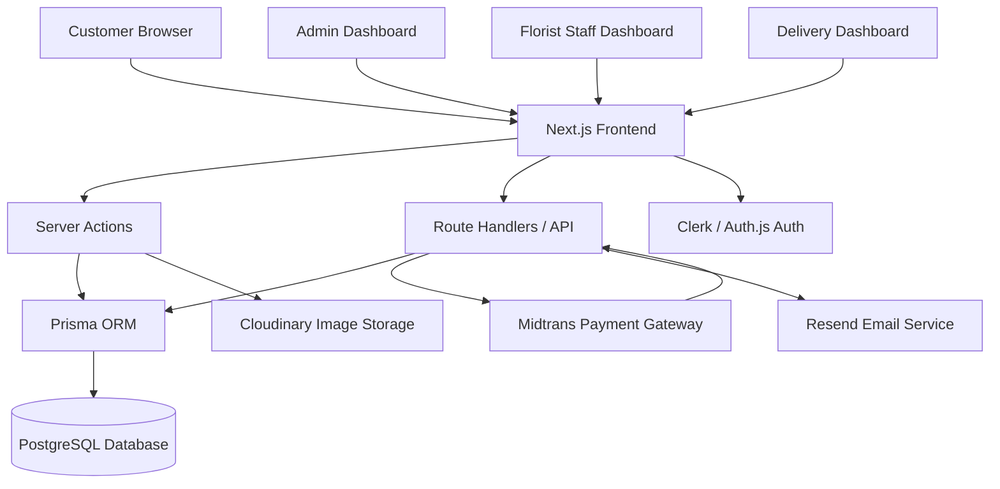
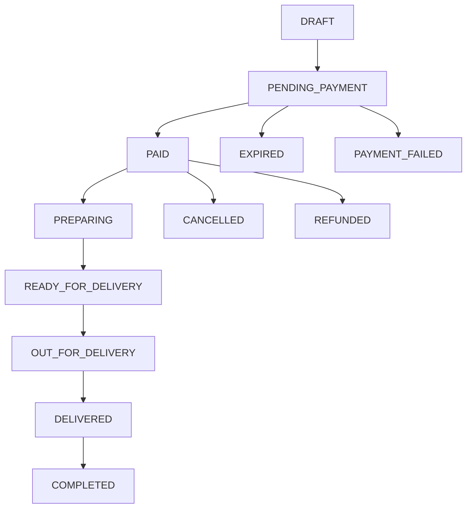

# Florist E-Commerce Website Architecture & Full Specification

## Example Brand

**Business Name:** Bloomora Florist  
**Business Type:** Online florist store  
**Location:** Bali, Indonesia  

**Main Products:**
- Fresh flower bouquets
- Preserved flower bouquets
- Wedding bouquets
- Flower boxes
- Sympathy flowers
- Birthday flowers
- Add-ons: greeting card, vase, chocolate, teddy bear

---

# 1. Recommended Tech Stack

| Layer | Recommended Tool | Purpose |
|---|---|---|
| Frontend + Backend | Next.js App Router + TypeScript | Full-stack application, storefront, admin dashboard, API routes, server-side logic |
| UI | Tailwind CSS + shadcn/ui | Clean, reusable components for storefront and admin |
| Database | PostgreSQL | Structured relational e-commerce data |
| ORM | Prisma ORM | Type-safe database access and migrations |
| Auth | Clerk or Auth.js | Login, customer account, admin/staff roles |
| Payment | Midtrans | Indonesia-friendly payment: QRIS, bank transfer, GoPay, cards |
| Image Storage | Cloudinary | Product image upload, optimization, delivery |
| Email | Resend | Order confirmation and notification emails |
| Deployment | Vercel | Smooth deployment for Next.js |

## Final Recommended Stack

```txt
Next.js App Router
TypeScript
Tailwind CSS
shadcn/ui
PostgreSQL
Prisma ORM
Clerk or Auth.js
Midtrans
Cloudinary
Resend
Vercel
```

---

# 2. Architecture Style

Use a **modular monolith**.

This means the system is built as one Next.js application, but internally separated into clean business modules.

## Why Modular Monolith?

A florist website needs reliable business logic more than distributed microservices. The most important parts are:

- Cart logic
- Product variant logic
- Stock reservation
- Payment webhook handling
- Delivery slot validation
- Admin access control
- Order lifecycle management

Starting with microservices would add unnecessary complexity.

---

# 3. High-Level System Architecture



---

# 4. Main Modules

```txt
Product Module
Cart / Bag Module
Checkout Module
Payment Module
Inventory Module
Order Module
Delivery Module
Admin Module
User / Role Module
Notification Module
```

---

# 5. User Roles

```txt
SUPER_ADMIN
ADMIN
FLORIST_STAFF
DELIVERY_STAFF
CUSTOMER
GUEST
```

## Permission Matrix

| Feature | Super Admin | Admin | Florist Staff | Delivery Staff | Customer |
|---|---:|---:|---:|---:|---:|
| Manage products | Yes | Yes | No | No | No |
| Manage variants | Yes | Yes | No | No | No |
| Manage stock | Yes | Yes | Limited | No | No |
| View all orders | Yes | Yes | Yes | Limited | No |
| Update preparation status | Yes | Yes | Yes | No | No |
| Update delivery status | Yes | Yes | No | Yes | No |
| Manage users | Yes | No | No | No | No |
| Manage payment settings | Yes | No | No | No | No |
| Place order | No | No | No | No | Yes |
| Track own order | No | No | No | No | Yes |

---

# 6. Customer Website Pages

```txt
/
Home

/shop
Product catalog

/shop/[category]
Category page

/product/[slug]
Product detail

/cart
Shopping bag

/checkout
Checkout

/payment/pending
Payment pending

/payment/success
Payment success

/payment/failed
Payment failed

/account
Customer dashboard

/account/orders
Customer order history

/account/orders/[orderNumber]
Order detail and tracking
```

---

# 7. Admin Dashboard Pages

```txt
/admin
Dashboard overview

/admin/products
Product list

/admin/products/new
Create product

/admin/products/[id]/edit
Edit product

/admin/categories
Manage categories

/admin/inventory
Raw material stock

/admin/inventory/movements
Stock movement history

/admin/orders
Order management

/admin/orders/[id]
Order detail

/admin/delivery
Delivery calendar

/admin/payments
Payment records

/admin/users
User and staff management

/admin/settings
Store settings
```

---

# 8. Staff Dashboard Pages

```txt
/staff/florist
Florist preparation queue

/staff/delivery
Delivery queue
```

---

# 9. Core Business Rules

```txt
1. Customer can browse products without login.
2. Customer must enter recipient and delivery details before payment.
3. Product can have multiple variants.
4. Product variant can consume raw materials.
5. Stock is calculated from raw material availability.
6. Cart items do not deduct stock.
7. Stock is reserved only during checkout.
8. Unpaid orders expire after 15 minutes.
9. Payment success is confirmed only by Midtrans webhook.
10. Admin can manually mark bank transfer orders only if manual payment is enabled.
11. Delivery slot has daily capacity.
12. Florist staff can only see paid orders ready for preparation.
13. Delivery staff can only see orders assigned to them.
14. Webhook processing must be idempotent.
15. Stock deduction must not happen twice.
```

---

# 10. Product Logic

## Product Example

```txt
Product Name: Romantic Red Rose Bouquet
Category: Birthday Flowers
Base Price: Rp 350,000
Status: Active
Delivery Type: Same-day eligible
```

## Variants

```txt
Variant 1:
Size: Small
Color: Red
Wrapper: Standard
Price Adjustment: Rp 0

Variant 2:
Size: Medium
Color: Red
Wrapper: Premium
Price Adjustment: Rp 150,000

Variant 3:
Size: Large
Color: Red
Wrapper: Premium
Price Adjustment: Rp 300,000
```

## Add-ons

```txt
Greeting Card: Rp 15,000
Glass Vase: Rp 75,000
Chocolate: Rp 50,000
Teddy Bear: Rp 90,000
```

## Variant Recipe Example

For **Romantic Red Rose Bouquet - Medium**:

```txt
Red Rose Stem: 24 pcs
Baby Breath: 3 bunches
Premium Wrapper: 1 pcs
Ribbon: 1 pcs
Water Tube: 1 pcs
```

This allows the system to check whether the store has enough raw materials before allowing checkout.

---

# 11. Inventory Logic

## Two Stock Types

### 1. Finished Product Stock

Used for ready-made items.

```txt
Preserved Flower Box - Pink = 8 available
Mini Bouquet - Graduation = 12 available
```

### 2. Material-Based Stock

Used for fresh bouquets.

```txt
Red Rose Stem = 300 pcs
White Rose Stem = 180 pcs
Baby Breath = 40 bunches
Premium Wrapper = 100 pcs
Ribbon = 150 pcs
Glass Vase = 30 pcs
```

## Stock Availability Formula

```txt
Available Quantity =
minimum(
  Red Rose Stock / Red Rose Needed,
  Baby Breath Stock / Baby Breath Needed,
  Wrapper Stock / Wrapper Needed,
  Ribbon Stock / Ribbon Needed
)
```

Example:

```txt
Red Rose Stock = 300
Needed per bouquet = 24

Baby Breath Stock = 40
Needed per bouquet = 3

Premium Wrapper Stock = 100
Needed per bouquet = 1

Ribbon Stock = 150
Needed per bouquet = 1
```

Calculation:

```txt
Red Rose: 300 / 24 = 12 bouquets
Baby Breath: 40 / 3 = 13 bouquets
Wrapper: 100 / 1 = 100 bouquets
Ribbon: 150 / 1 = 150 bouquets
```

Final available quantity:

```txt
12 bouquets
```

Red rose is the limiting material.

---

# 12. Cart / Bag Logic

## Cart Rules

```txt
1. Guest users can add items to cart using session ID.
2. Logged-in users have cart linked to user ID.
3. Cart item stores:
   - product ID
   - variant ID
   - quantity
   - add-ons
   - card message
   - delivery date preference
4. Cart does not deduct stock.
5. Cart validates stock before checkout.
6. Cart price recalculates on every checkout attempt.
```

## Cart Item Example

```json
{
  "productId": "prod_rose_001",
  "variantId": "var_medium_red_premium",
  "quantity": 1,
  "addons": [
    {
      "addonId": "addon_card",
      "quantity": 1
    },
    {
      "addonId": "addon_vase",
      "quantity": 1
    }
  ],
  "cardMessage": "Happy birthday, wishing you a beautiful day.",
  "deliveryDate": "2026-05-14",
  "deliverySlotId": "slot_10_12"
}
```

---

# 13. Checkout Logic

## Checkout Flow

```txt
1. Customer opens cart.
2. System recalculates product price.
3. System checks variant availability.
4. Customer enters recipient details.
5. Customer selects delivery date and time slot.
6. System validates delivery slot capacity.
7. System calculates delivery fee.
8. Customer applies voucher code.
9. System creates order with status PENDING_PAYMENT.
10. System creates stock reservation for 15 minutes.
11. System creates Midtrans transaction.
12. Customer pays.
13. Midtrans sends webhook.
14. System verifies webhook.
15. System changes order to PAID.
16. System converts reserved stock into actual stock deduction.
17. System sends confirmation email.
18. Florist staff sees order in preparation queue.
```

## Checkout Price Formula

```txt
Subtotal =
Product Variant Price × Quantity
+ Add-ons Total

Total =
Subtotal
+ Delivery Fee
+ Tax, if applicable
- Discount
```

Example:

```txt
Romantic Rose Bouquet Medium: Rp 500,000
Greeting Card: Rp 15,000
Glass Vase: Rp 75,000
Delivery Fee: Rp 35,000
Discount: Rp 25,000

Total = 500,000 + 15,000 + 75,000 + 35,000 - 25,000
Total = Rp 600,000
```

---

# 14. Stock Reservation Logic

## Why Reservation Is Needed

Without reservation:

```txt
Customer A checks out 1 bouquet.
Customer B checks out the same bouquet at the same time.
Both pay.
Stock only supports 1 bouquet.
System oversells.
```

## Correct Logic

When checkout is created:

```txt
Order status: PENDING_PAYMENT
Reservation status: ACTIVE
Reservation expiry: now + 15 minutes
```

If customer pays:

```txt
Reservation becomes COMMITTED
Stock is deducted permanently
Order becomes PAID
```

If customer does not pay:

```txt
Reservation becomes EXPIRED
Stock is released
Order becomes EXPIRED
```

## Reservation Statuses

```txt
ACTIVE
COMMITTED
EXPIRED
CANCELLED
```

---

# 15. Payment Logic

## Payment Flow With Midtrans

```txt
1. Backend creates order.
2. Backend sends transaction details to Midtrans Snap.
3. Midtrans returns payment token / redirect URL.
4. Customer completes payment.
5. Midtrans sends HTTP notification webhook to your backend.
6. Backend verifies notification.
7. Backend updates payment and order status.
```

## Payment Status Mapping

| Midtrans Status | Internal Payment Status | Order Status |
|---|---|---|
| settlement | PAID | PAID |
| capture | PAID | PAID |
| pending | PENDING | PENDING_PAYMENT |
| deny | FAILED | PAYMENT_FAILED |
| expire | EXPIRED | EXPIRED |
| cancel | CANCELLED | CANCELLED |
| refund | REFUNDED | REFUNDED |

## Webhook Rules

```txt
1. Webhook must be verified.
2. Webhook must be idempotent.
3. Duplicate webhook must not deduct stock twice.
4. Payment update and stock deduction must happen inside a database transaction.
5. Webhook should be the source of truth, not the frontend success page.
```

---

# 16. Order Lifecycle

## Order Statuses

```txt
DRAFT
PENDING_PAYMENT
PAID
PREPARING
READY_FOR_DELIVERY
OUT_FOR_DELIVERY
DELIVERED
COMPLETED
PAYMENT_FAILED
EXPIRED
CANCELLED
REFUNDED
```

## Flow



---

# 17. Delivery Logic

## Delivery Fields

```txt
Recipient Name
Recipient Phone
Delivery Address
Google Maps Link
Delivery Notes
Delivery Date
Delivery Time Slot
Sender Name
Anonymous Sender Option
Card Message
```

## Delivery Slot Example

```txt
09:00 - 11:00
11:00 - 13:00
13:00 - 15:00
15:00 - 17:00
17:00 - 19:00
```

## Delivery Slot Rules

```txt
1. Each slot has max capacity.
2. Same-day delivery cutoff: 14:00.
3. Customer cannot select past dates.
4. Admin can block unavailable dates.
5. Delivery staff can update status to OUT_FOR_DELIVERY and DELIVERED.
```

Example:

```txt
Slot: 11:00 - 13:00
Max Orders: 8
Current Paid Orders: 7
Available: Yes

If Current Paid Orders = 8
Available: No
```

---

# 18. Database Design

## Core Tables

```txt
users
user_roles
categories
products
product_images
product_variants
addons
product_addons
inventory_items
variant_recipes
stock_movements
stock_reservations
carts
cart_items
cart_item_addons
orders
order_items
order_item_addons
payments
delivery_addresses
delivery_slots
discount_codes
activity_logs
```

---

# 19. Prisma Schema Example

```prisma
enum Role {
  SUPER_ADMIN
  ADMIN
  FLORIST_STAFF
  DELIVERY_STAFF
  CUSTOMER
}

enum ProductStatus {
  DRAFT
  ACTIVE
  ARCHIVED
}

enum OrderStatus {
  DRAFT
  PENDING_PAYMENT
  PAID
  PREPARING
  READY_FOR_DELIVERY
  OUT_FOR_DELIVERY
  DELIVERED
  COMPLETED
  PAYMENT_FAILED
  EXPIRED
  CANCELLED
  REFUNDED
}

enum PaymentStatus {
  PENDING
  PAID
  FAILED
  EXPIRED
  CANCELLED
  REFUNDED
}

enum StockMovementType {
  IN
  OUT
  RESERVED
  RELEASED
  ADJUSTMENT
}

enum ReservationStatus {
  ACTIVE
  COMMITTED
  EXPIRED
  CANCELLED
}

model User {
  id        String   @id @default(cuid())
  email     String   @unique
  name      String?
  phone     String?
  role      Role     @default(CUSTOMER)
  createdAt DateTime @default(now())
  updatedAt DateTime @updatedAt

  orders    Order[]
  carts     Cart[]
}

model Category {
  id        String   @id @default(cuid())
  name      String
  slug      String   @unique
  imageUrl  String?
  createdAt DateTime @default(now())

  products  Product[]
}

model Product {
  id          String        @id @default(cuid())
  categoryId  String
  name        String
  slug        String        @unique
  description String
  basePrice   Int
  status      ProductStatus @default(DRAFT)
  isSameDayEligible Boolean @default(false)
  createdAt   DateTime      @default(now())
  updatedAt   DateTime      @updatedAt

  category    Category       @relation(fields: [categoryId], references: [id])
  images      ProductImage[]
  variants    ProductVariant[]
  addons      ProductAddon[]
}

model ProductImage {
  id        String   @id @default(cuid())
  productId String
  url       String
  altText   String?
  sortOrder Int      @default(0)

  product   Product  @relation(fields: [productId], references: [id])
}

model ProductVariant {
  id          String   @id @default(cuid())
  productId   String
  name        String
  size        String?
  color       String?
  wrapper     String?
  priceAdjust Int      @default(0)
  sku         String   @unique
  isActive    Boolean  @default(true)

  product     Product  @relation(fields: [productId], references: [id])
  recipes     VariantRecipe[]
  cartItems   CartItem[]
  orderItems  OrderItem[]
}

model Addon {
  id        String   @id @default(cuid())
  name      String
  price     Int
  stockItemId String?
  isActive  Boolean @default(true)

  productAddons ProductAddon[]
  cartItemAddons CartItemAddon[]
  orderItemAddons OrderItemAddon[]
}

model ProductAddon {
  id        String @id @default(cuid())
  productId String
  addonId   String

  product   Product @relation(fields: [productId], references: [id])
  addon     Addon   @relation(fields: [addonId], references: [id])

  @@unique([productId, addonId])
}

model InventoryItem {
  id          String   @id @default(cuid())
  name        String
  unit        String
  sku         String   @unique
  currentQty  Int      @default(0)
  reorderLevel Int     @default(0)
  createdAt   DateTime @default(now())
  updatedAt   DateTime @updatedAt

  recipes     VariantRecipe[]
  movements   StockMovement[]
  reservations StockReservation[]
}

model VariantRecipe {
  id              String @id @default(cuid())
  variantId        String
  inventoryItemId  String
  quantityNeeded   Int

  variant          ProductVariant @relation(fields: [variantId], references: [id])
  inventoryItem    InventoryItem  @relation(fields: [inventoryItemId], references: [id])

  @@unique([variantId, inventoryItemId])
}

model StockMovement {
  id              String            @id @default(cuid())
  inventoryItemId  String
  type            StockMovementType
  quantity        Int
  reason          String?
  orderId         String?
  createdById     String?
  createdAt       DateTime          @default(now())

  inventoryItem   InventoryItem     @relation(fields: [inventoryItemId], references: [id])
}

model StockReservation {
  id              String            @id @default(cuid())
  orderId         String
  inventoryItemId  String
  quantity        Int
  status          ReservationStatus @default(ACTIVE)
  expiresAt       DateTime
  createdAt       DateTime          @default(now())

  order           Order             @relation(fields: [orderId], references: [id])
  inventoryItem   InventoryItem     @relation(fields: [inventoryItemId], references: [id])
}

model Cart {
  id        String   @id @default(cuid())
  userId    String?
  sessionId String?
  createdAt DateTime @default(now())
  updatedAt DateTime @updatedAt

  user      User?     @relation(fields: [userId], references: [id])
  items     CartItem[]
}

model CartItem {
  id          String @id @default(cuid())
  cartId      String
  productId   String
  variantId   String
  quantity    Int
  cardMessage String?

  cart        Cart           @relation(fields: [cartId], references: [id])
  variant     ProductVariant @relation(fields: [variantId], references: [id])
  addons      CartItemAddon[]
}

model CartItemAddon {
  id         String @id @default(cuid())
  cartItemId String
  addonId    String
  quantity   Int

  cartItem   CartItem @relation(fields: [cartItemId], references: [id])
  addon      Addon    @relation(fields: [addonId], references: [id])
}

model Order {
  id              String      @id @default(cuid())
  orderNumber     String      @unique
  userId          String?
  status          OrderStatus @default(PENDING_PAYMENT)
  subtotal        Int
  deliveryFee     Int
  discountAmount  Int         @default(0)
  total           Int
  recipientName   String
  recipientPhone  String
  senderName      String
  isAnonymous     Boolean     @default(false)
  cardMessage     String?
  deliveryDate    DateTime
  deliverySlotId  String
  deliveryAddress String
  deliveryNotes   String?
  createdAt       DateTime    @default(now())
  updatedAt       DateTime    @updatedAt

  user            User?       @relation(fields: [userId], references: [id])
  items           OrderItem[]
  payments        Payment[]
  reservations    StockReservation[]
}

model OrderItem {
  id          String @id @default(cuid())
  orderId     String
  productId   String
  variantId   String
  productName String
  variantName String
  unitPrice   Int
  quantity    Int
  totalPrice  Int

  order       Order          @relation(fields: [orderId], references: [id])
  variant     ProductVariant @relation(fields: [variantId], references: [id])
  addons      OrderItemAddon[]
}

model OrderItemAddon {
  id          String @id @default(cuid())
  orderItemId String
  addonId     String
  addonName   String
  unitPrice   Int
  quantity    Int
  totalPrice  Int

  orderItem   OrderItem @relation(fields: [orderItemId], references: [id])
  addon       Addon     @relation(fields: [addonId], references: [id])
}

model Payment {
  id                String        @id @default(cuid())
  orderId           String
  provider          String
  providerOrderId   String        @unique
  providerToken     String?
  redirectUrl       String?
  status            PaymentStatus @default(PENDING)
  amount            Int
  paidAt            DateTime?
  rawResponse       Json?
  createdAt         DateTime      @default(now())
  updatedAt         DateTime      @updatedAt

  order             Order         @relation(fields: [orderId], references: [id])
}

model DeliverySlot {
  id        String   @id @default(cuid())
  label     String
  startTime String
  endTime   String
  capacity  Int
  isActive  Boolean @default(true)
}

model DiscountCode {
  id          String   @id @default(cuid())
  code        String   @unique
  type        String
  value       Int
  minSpend    Int?
  maxUses     Int?
  usedCount   Int      @default(0)
  startsAt    DateTime?
  endsAt      DateTime?
  isActive    Boolean  @default(true)
}

model ActivityLog {
  id        String   @id @default(cuid())
  actorId   String?
  action    String
  entity    String
  entityId  String?
  metadata  Json?
  createdAt DateTime @default(now())
}
```

---

# 20. Backend Logic Examples

## A. Calculate Variant Availability

```ts
async function calculateVariantAvailability(variantId: string) {
  const recipes = await prisma.variantRecipe.findMany({
    where: { variantId },
    include: { inventoryItem: true },
  });

  if (recipes.length === 0) return 0;

  const availability = recipes.map((recipe) => {
    return Math.floor(
      recipe.inventoryItem.currentQty / recipe.quantityNeeded
    );
  });

  return Math.min(...availability);
}
```

---

## B. Add to Cart Logic

```ts
async function addToCart({
  userId,
  sessionId,
  productId,
  variantId,
  quantity,
  addons,
  cardMessage,
}) {
  const availableQty = await calculateVariantAvailability(variantId);

  if (availableQty < quantity) {
    throw new Error("Not enough stock available.");
  }

  const cart = await getOrCreateCart(userId, sessionId);

  return prisma.cartItem.create({
    data: {
      cartId: cart.id,
      productId,
      variantId,
      quantity,
      cardMessage,
      addons: {
        create: addons.map((addon) => ({
          addonId: addon.addonId,
          quantity: addon.quantity,
        })),
      },
    },
  });
}
```

---

## C. Checkout Logic

```ts
async function createCheckoutOrder({
  cartId,
  userId,
  recipient,
  delivery,
  discountCode,
}) {
  return prisma.$transaction(async (tx) => {
    const cart = await tx.cart.findUnique({
      where: { id: cartId },
      include: {
        items: {
          include: {
            variant: {
              include: {
                product: true,
                recipes: {
                  include: { inventoryItem: true },
                },
              },
            },
            addons: {
              include: { addon: true },
            },
          },
        },
      },
    });

    if (!cart || cart.items.length === 0) {
      throw new Error("Cart is empty.");
    }

    await validateDeliverySlot(tx, delivery.slotId, delivery.date);

    const pricing = calculateCartPricing(cart, discountCode);

    const order = await tx.order.create({
      data: {
        orderNumber: generateOrderNumber(),
        userId,
        status: "PENDING_PAYMENT",
        subtotal: pricing.subtotal,
        deliveryFee: pricing.deliveryFee,
        discountAmount: pricing.discountAmount,
        total: pricing.total,
        recipientName: recipient.name,
        recipientPhone: recipient.phone,
        senderName: recipient.senderName,
        isAnonymous: recipient.isAnonymous,
        cardMessage: recipient.cardMessage,
        deliveryDate: delivery.date,
        deliverySlotId: delivery.slotId,
        deliveryAddress: delivery.address,
        deliveryNotes: delivery.notes,
      },
    });

    for (const item of cart.items) {
      await tx.orderItem.create({
        data: {
          orderId: order.id,
          productId: item.productId,
          variantId: item.variantId,
          productName: item.variant.product.name,
          variantName: item.variant.name,
          unitPrice: item.variant.product.basePrice + item.variant.priceAdjust,
          quantity: item.quantity,
          totalPrice:
            (item.variant.product.basePrice + item.variant.priceAdjust) *
            item.quantity,
        },
      });

      for (const recipe of item.variant.recipes) {
        const requiredQty = recipe.quantityNeeded * item.quantity;

        if (recipe.inventoryItem.currentQty < requiredQty) {
          throw new Error(`Insufficient stock for ${recipe.inventoryItem.name}`);
        }

        await tx.stockReservation.create({
          data: {
            orderId: order.id,
            inventoryItemId: recipe.inventoryItemId,
            quantity: requiredQty,
            status: "ACTIVE",
            expiresAt: addMinutes(new Date(), 15),
          },
        });
      }
    }

    const payment = await createMidtransPayment(order);

    await tx.payment.create({
      data: {
        orderId: order.id,
        provider: "MIDTRANS",
        providerOrderId: payment.providerOrderId,
        providerToken: payment.token,
        redirectUrl: payment.redirectUrl,
        amount: order.total,
        status: "PENDING",
      },
    });

    return {
      order,
      payment,
    };
  });
}
```

---

## D. Payment Webhook Logic

```ts
async function handleMidtransWebhook(payload) {
  const verified = verifyMidtransSignature(payload);

  if (!verified) {
    throw new Error("Invalid payment signature.");
  }

  return prisma.$transaction(async (tx) => {
    const payment = await tx.payment.findUnique({
      where: {
        providerOrderId: payload.order_id,
      },
      include: {
        order: {
          include: {
            reservations: true,
          },
        },
      },
    });

    if (!payment) {
      throw new Error("Payment not found.");
    }

    if (payment.status === "PAID") {
      return { message: "Webhook already processed." };
    }

    const mappedStatus = mapMidtransStatus(payload.transaction_status);

    await tx.payment.update({
      where: { id: payment.id },
      data: {
        status: mappedStatus.paymentStatus,
        rawResponse: payload,
        paidAt: mappedStatus.paymentStatus === "PAID" ? new Date() : null,
      },
    });

    await tx.order.update({
      where: { id: payment.orderId },
      data: {
        status: mappedStatus.orderStatus,
      },
    });

    if (mappedStatus.paymentStatus === "PAID") {
      for (const reservation of payment.order.reservations) {
        if (reservation.status !== "ACTIVE") continue;

        await tx.inventoryItem.update({
          where: { id: reservation.inventoryItemId },
          data: {
            currentQty: {
              decrement: reservation.quantity,
            },
          },
        });

        await tx.stockReservation.update({
          where: { id: reservation.id },
          data: {
            status: "COMMITTED",
          },
        });

        await tx.stockMovement.create({
          data: {
            inventoryItemId: reservation.inventoryItemId,
            type: "OUT",
            quantity: reservation.quantity,
            reason: `Order paid: ${payment.order.orderNumber}`,
            orderId: payment.orderId,
          },
        });
      }

      await sendOrderConfirmationEmail(payment.orderId);
    }

    return { success: true };
  });
}
```

---

# 21. API / Route Handler Structure

```txt
app/api/
  payments/
    midtrans/
      create/route.ts
      webhook/route.ts

  upload/
    cloudinary-signature/route.ts

  orders/
    track/[orderNumber]/route.ts
```

---

# 22. Server Actions Structure

```txt
src/server/actions/
  product.actions.ts
  variant.actions.ts
  inventory.actions.ts
  cart.actions.ts
  checkout.actions.ts
  order.actions.ts
  delivery.actions.ts
  discount.actions.ts
  user.actions.ts
```

---

# 23. Service Layer Structure

```txt
src/server/services/
  product.service.ts
  pricing.service.ts
  stock.service.ts
  reservation.service.ts
  payment.service.ts
  delivery.service.ts
  notification.service.ts
  auth.service.ts
```

---

# 24. Admin Logic

## Product Management

Admin can:

```txt
Create product
Edit product
Archive product
Upload images
Set category
Create variants
Attach add-ons
Attach recipe/material requirements
Set same-day delivery eligibility
```

## Inventory Management

Admin can:

```txt
Add stock
Reduce stock
Adjust stock
View low-stock items
View stock movement history
Set reorder level
```

Example:

```txt
Inventory Item: Red Rose Stem
Current Qty: 300
Reorder Level: 50

If currentQty <= reorderLevel:
Show warning: Low stock
```

## Order Management

Admin can:

```txt
View all orders
Filter by status
Open order detail
Update order status
Assign florist staff
Assign delivery staff
Cancel order
Refund order manually after payment provider refund
Print order card
Print delivery note
```

---

# 25. Customer Order Example

## Customer Action

```txt
Customer buys:
Romantic Red Rose Bouquet - Medium

Add-ons:
- Greeting Card
- Glass Vase

Delivery:
Date: 14 May 2026
Slot: 11:00 - 13:00
Address: Canggu, Bali
```

## System Creates Order

```json
{
  "orderNumber": "BLM-20260514-0001",
  "status": "PENDING_PAYMENT",
  "subtotal": 590000,
  "deliveryFee": 35000,
  "discountAmount": 25000,
  "total": 600000,
  "paymentStatus": "PENDING",
  "deliveryStatus": "WAITING_PAYMENT"
}
```

## Stock Reservation Created

```txt
Red Rose Stem: reserved 24
Baby Breath: reserved 3
Premium Wrapper: reserved 1
Ribbon: reserved 1
Glass Vase: reserved 1
```

## After Payment Success

```txt
Order status: PAID
Payment status: PAID
Stock reservation: COMMITTED
Stock deducted permanently
Email sent to customer
Order appears in florist preparation dashboard
```

---

# 26. Florist Staff Workflow

## Preparation Queue

Florist staff sees:

```txt
Order Number
Delivery Date
Delivery Slot
Bouquet Name
Variant
Card Message
Add-ons
Preparation Status
```

## Status Flow

```txt
PAID
→ PREPARING
→ READY_FOR_DELIVERY
```

Florist staff should not access payment settings, product pricing, or full customer database.

---

# 27. Delivery Staff Workflow

Delivery staff sees:

```txt
Order Number
Recipient Name
Recipient Phone
Delivery Address
Google Maps Link
Delivery Notes
Delivery Slot
Status
```

## Delivery Status Flow

```txt
READY_FOR_DELIVERY
→ OUT_FOR_DELIVERY
→ DELIVERED
```

## Optional Proof of Delivery

```txt
Photo upload
Recipient signature
Delivery note
Delivered timestamp
```

---

# 28. Notifications

## Email Notifications

Use Resend for:

```txt
Order created / pending payment
Payment success
Order preparing
Order out for delivery
Order delivered
Admin low-stock alert
```

## WhatsApp Optional Later

For florist business, WhatsApp is useful for:

```txt
Order confirmation
Delivery confirmation
Manual customer service
Abandoned checkout reminder
Custom bouquet consultation
```

Do not start with WhatsApp automation in the MVP. Add it after checkout and payment are stable.

---

# 29. Folder Architecture

```txt
src/
  app/
    (store)/
      page.tsx
      shop/
      product/[slug]/
      cart/
      checkout/
      account/
    admin/
      dashboard/
      products/
      inventory/
      orders/
      delivery/
      users/
      settings/
    staff/
      florist/
      delivery/
    api/
      payments/
      upload/
      orders/

  components/
    ui/
    layout/
    product/
    cart/
    checkout/
    admin/
    staff/

  server/
    actions/
    services/
    validations/

  lib/
    db.ts
    auth.ts
    midtrans.ts
    cloudinary.ts
    resend.ts
    utils.ts

  prisma/
    schema.prisma

  types/
    product.ts
    order.ts
    payment.ts
```

---

# 30. MVP Build Scope

## Phase 1 — Core Store

```txt
Homepage
Product catalog
Product detail
Product variants
Cart / bag
Checkout form
Midtrans payment
Payment webhook
Basic order confirmation
Admin product CRUD
Admin order list
```

## Phase 2 — Inventory

```txt
Raw material stock
Variant recipe
Stock reservation
Stock movement history
Low-stock alert
Admin stock adjustment
```

## Phase 3 — Operations

```txt
Florist preparation dashboard
Delivery dashboard
Delivery slot capacity
Order status tracking
Customer account
Email notifications
```

## Phase 4 — Growth

```txt
Discount codes
Abandoned cart
WhatsApp notifications
Analytics dashboard
Customer segmentation
Custom bouquet inquiry form
SEO blog
```

---

# 31. Final Architecture Decision

Build the florist website with:

```txt
Frontend: Next.js App Router + TypeScript
UI: Tailwind CSS + shadcn/ui
Backend: Next.js Server Actions + Route Handlers
Database: PostgreSQL
ORM: Prisma
Auth: Clerk or Auth.js
Payment: Midtrans
Image Storage: Cloudinary
Email: Resend
Hosting: Vercel
```

Use this logic pattern:

```txt
Cart does not deduct stock.
Checkout creates stock reservation.
Payment webhook confirms payment.
Webhook commits reservation and deducts stock.
Expired unpaid order releases stock.
Admin manages products, variants, recipes, inventory, and orders.
Florist staff handles preparation.
Delivery staff handles delivery.
```

This architecture supports a production florist e-commerce website with:

```txt
Bag/cart
Checkout
Payments
Product variants
Raw material stock
Finished product stock
Database
User roles
Admin dashboard
Florist staff dashboard
Delivery workflow
Order tracking
Email notifications
Payment webhook logic
Stock reservation logic
```
